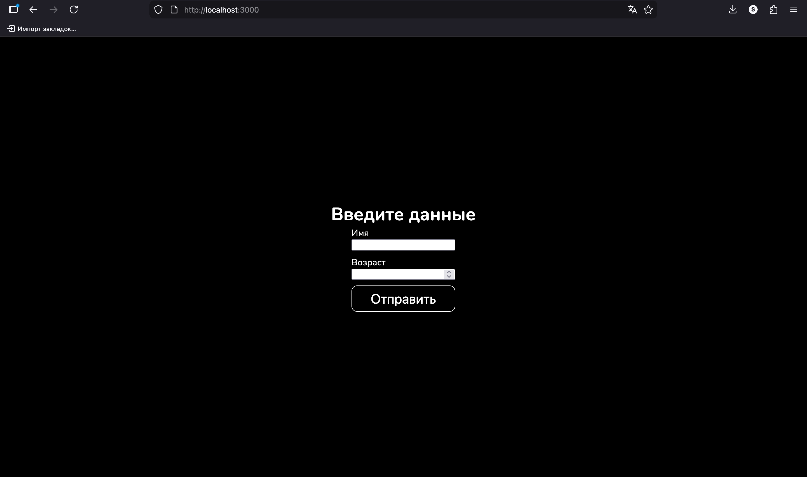
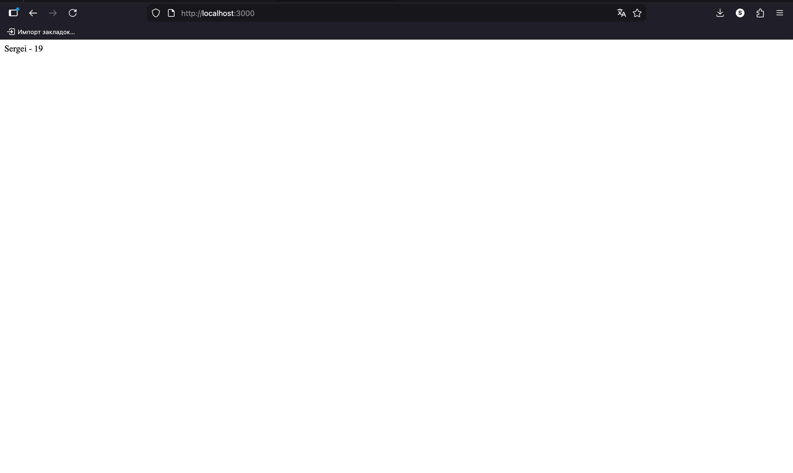
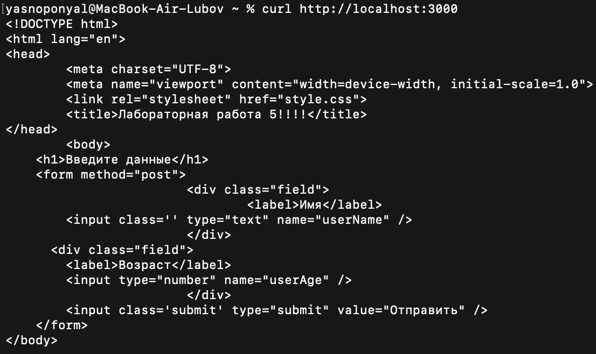
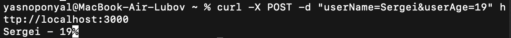
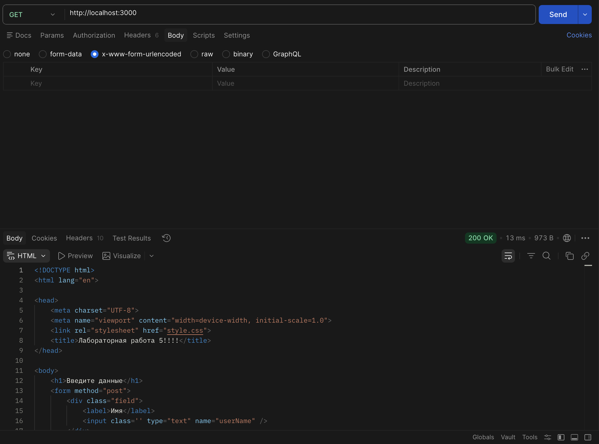
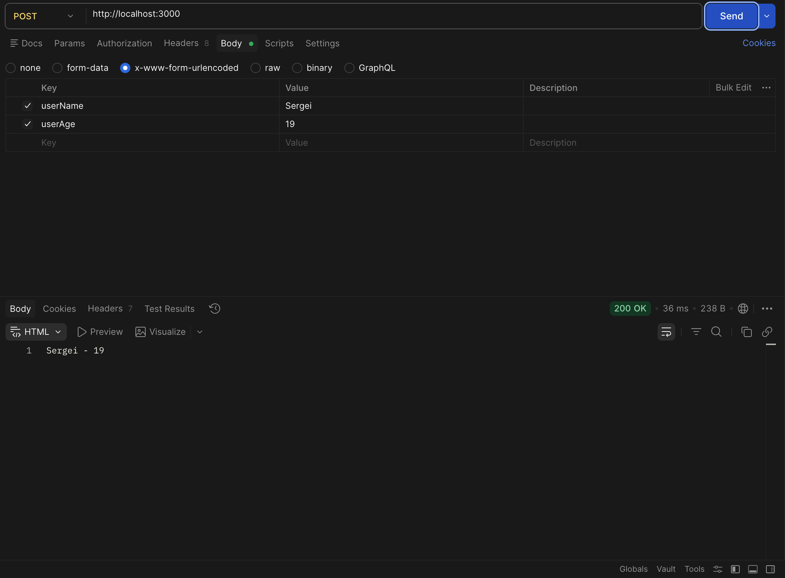

# Лабораторная работа 5
## Описание инструментария:
- HTML, CSS
- JavaScript (Node.js)
- Express.js

## Код script.js
```JavaScript
const express = require("express");
const path = require('path');
const app = express();

app.use(express.static(path.join(__dirname, 'public')));
const urlencodedParser = express.urlencoded({extended: false});
  
app.get("/", function (_, response) {
    response.sendFile(__dirname + "/index.html");
});
app.post("/", urlencodedParser, function (request, response) {
    if(!request.body) return response.sendStatus(400);
    console.log(request.body);
    response.send(`${request.body.userName} - ${request.body.userAge}`);
});
   
app.listen(3000, ()=>console.log("Сервер запущен..."));
```

## Работа в браузере
### GET-запрос

### POST-запрос


## Работа через cURL
### GET-запрос

### POST-запрос


## Работа через Postman
### GET-запрос

### POST-запрос


### Ефимов Сергей Робертович, 2 курс, ИВТ-2